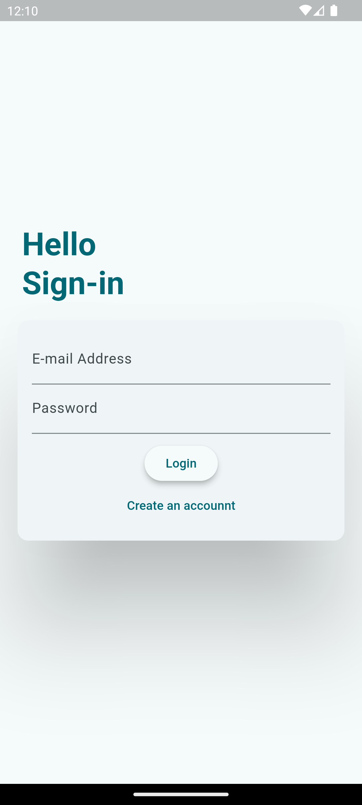
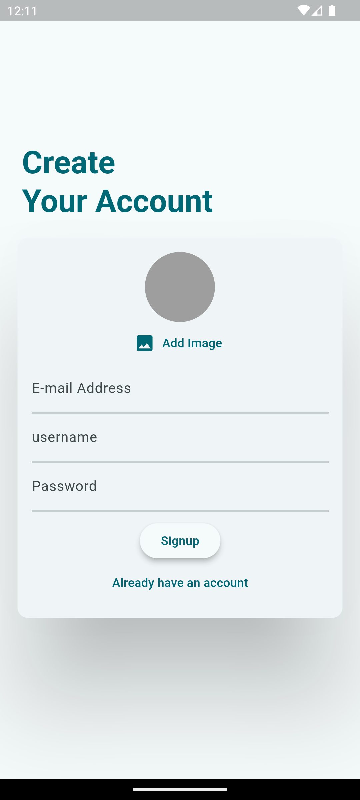
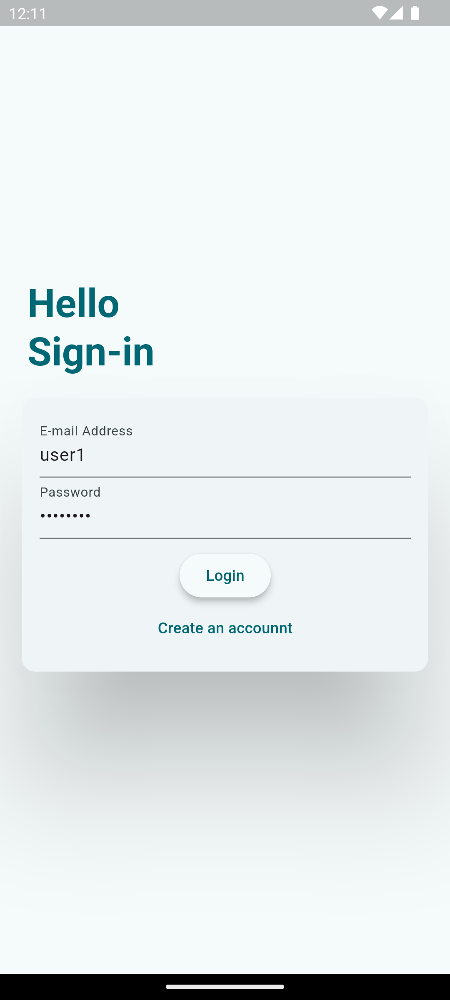
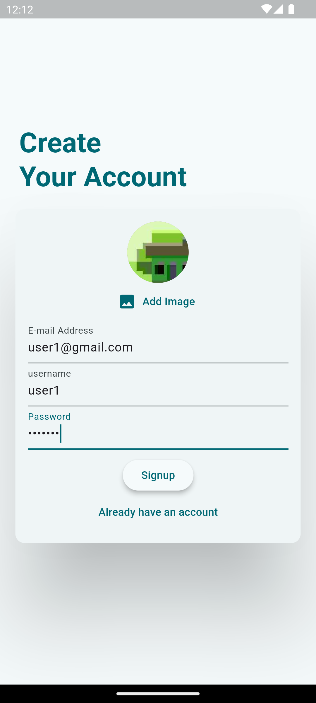
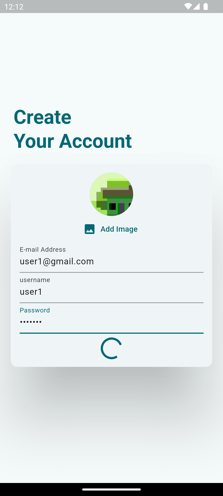
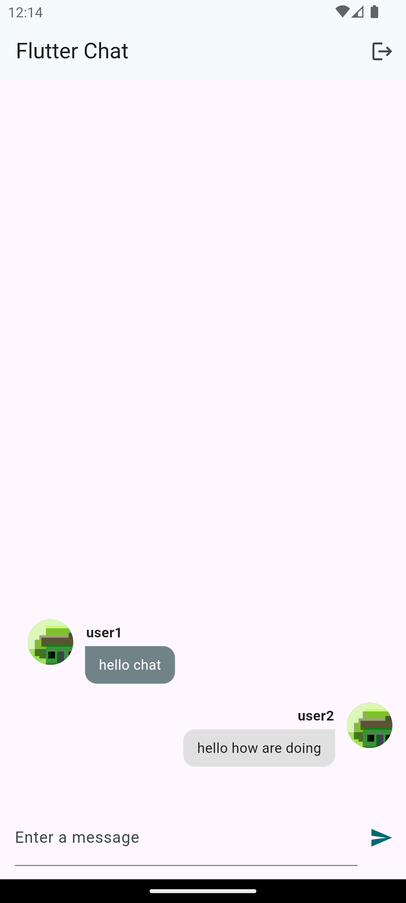

# CHAT APP

Flutter chat application uses Firebase (authentication, firestore, storage and messaging)
with some animation.

## Description

This project is a flutter chat mobile application which gives the user the ability to :

1. Switch between sign-in and sign-up modes using the Create an account/Already have an account button.
2. Sign-up with e-mail, password, username and a photo (all managed by firebase).
3. Sign-in using preregistered user credentials (process managed by firebase).
4. Navigate to chatting screen after successful signing-in or signing-up.
5. Send messages and interact with other users via the new message field
   by sending new messages.
6. Sign-out by pressing the sign-out button at the top right corner of the chat screen.

## Back-end

Using flutter firebase cli functions (after installing it via terminal and configuring the firebase project) :

1. Firebase Authentication (to store user credentials).
2. Firebase Storage (to store the user image).
3. Firebase Firestore (to store each user info like username, link to his photo and email address ||
   also to store each message specific info like date, time, content ......).

## Animations

Two explicit animations each one of them presented by an opacity animation,
applied to create a user friendly experience by showing the username field
and user image picker in an eye appealing way when switching between sign-in
and sign-up modes.

## Features of the app With Screenshots

| Task                  | Screenshot                             | Task                  | Screenshot                             |
| --------------------- | -------------------------------------- | --------------------- | -------------------------------------- |
| Sign-in Screen        |         | Sign-up Screen        |         |
| Filled Sign-in Screen |  | Filled Sign-up Screen |  |
| Signing-up in Process |  | Chat Screen           |            |
